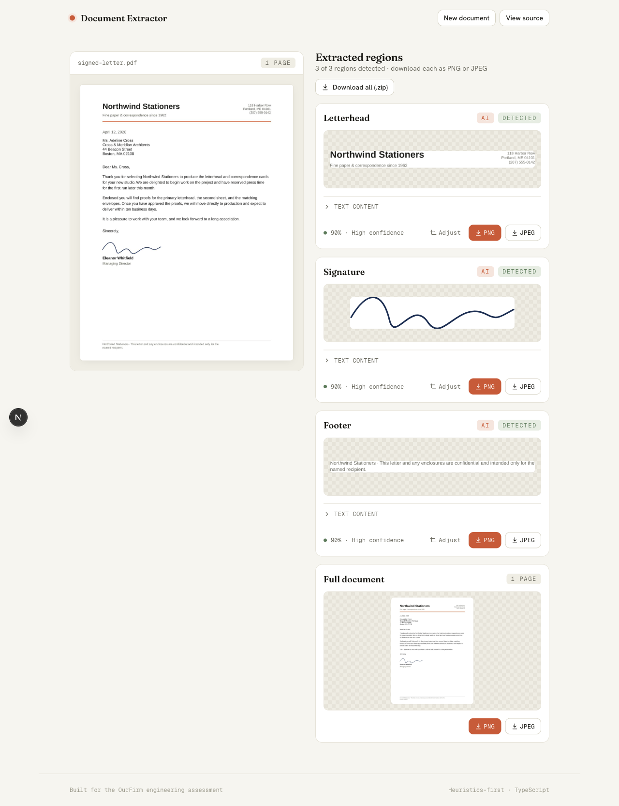

# Document Extractor

Upload a PDF and extract three regions — **signature**, **letterhead**, and
**footer** — each downloadable as a **PNG or JPEG**. Built for the OurFirm Full
Stack engineering assessment.

> **Live demo:** **https://ourfirm-takehome.vercel.app**
> (client on Vercel · API on Heroku)



---

## Quick start

You need **Node 22** (see `.nvmrc`). Pick one:

### Docker (single command)

```bash
docker compose up --build
```

Then open **http://localhost:3000**. This builds and runs both the client
(`:3000`) and the processing server (`:4000`).

### Local dev (hot reload)

```bash
nvm use            # Node 22
npm install
npm run dev        # web on :3000, server on :4000 (concurrently)
```

Either way, click **Try a sample** to run a bundled document, or drop in your own
PDF.

---

## What it does

1. You upload a **PDF, image (PNG/JPG), or Word `.docx`** (drag-and-drop or file
   picker), or pick a bundled sample. (`.docx` is rendered to a page image in the
   browser; images are treated as a single page.)
2. The **server** rasterizes the pages, locates the three regions with
   transparent heuristics, and crops each one.
3. The **client** shows a preview of the document alongside each extracted region
   with its detection confidence (colour-coded), the selectable text it contains,
   and one-click **PNG / JPEG** downloads — per region, the whole document as a
   single image, or everything in one **ZIP**.

Imperfect extraction is expected and handled: when a region isn't present (or
can't be found confidently) the UI says so clearly rather than guessing.

---

## Architecture

Two separate projects + a shared contract, in an npm-workspaces monorepo:

```
ourfirm-takehome/
├── apps/
│   ├── web/        Next.js 16 client — upload, document viewing, downloads
│   └── server/     Fastify backend — the document-processing engine
├── packages/
│   └── shared/     @ourfirm/shared — the API/region/error contract (one source of truth)
└── scripts/        sample-document generator
```

- **Client = viewing, server = processing.** The split keeps the heavy,
  native-dependency work (PDF rasterization, image processing) in a real
  long-running Node container, instead of fighting serverless function limits.
- **`@ourfirm/shared`** is imported by both apps, so the API shape, region/error
  types, and upload limits can never drift apart.
- The client talks to the server over one HTTP endpoint, `POST /api/extract`
  (multipart upload → JSON result or a human-readable error).

### How extraction works (the heuristics)

Region detection is **our own logic**, not a black box. Each page is rasterized
at ~2× (≈144 DPI) with `pdfjs-dist` + `@napi-rs/canvas`; the PDF text layer is
read in the same pass so text positions share the image's coordinate system.

| Region | Approach |
| --- | --- |
| **Letterhead** | Top band of page 1; tightened to the ink bounding box. |
| **Footer** | Bottom band of the last page; same ink-tightening. |
| **Signature** | The interesting one (see below). |

**Signatures** are detected by a key insight: a real signature is **drawn ink
with no text-layer words underneath it**, whereas a footer or a typed name *is*
text. So the detector searches the area *below the letterhead and above the
footer* (the footer band is excluded outright), finds connected ink clusters,
and strongly prefers clusters with **low text-layer overlap** — rejecting printed
text. It also biases toward ink just below a closing anchor ("Sincerely",
"Regards", "IN WITNESS WHEREOF", "PROVIDER", "By:"). Crops are encoded to both
PNG and JPEG with `sharp`.

A **confidence** score (0–1) accompanies each detection and is surfaced in the UI
with a colour: green (high), amber (moderate — eyeball the crop), red (low).

**Optional AI layer.** If `GEMINI_API_KEY` is set, an optional Gemini vision pass
locates the regions and its bounding boxes override the heuristics when returned
(falling back to them per-region on any miss or error — extraction never fails
because of it). Each result shows whether a region was found by the **heuristics**
or by **AI**. The heuristics remain the default, so the app works with no key and
is never LLM-only.

**Adjustable crop.** Every detected region can be re-cropped in the browser — drag
the handles to include less or more of the page, and the preview, downloads, and
ZIP all use the adjusted crop.

---

## Tech choices & trade-offs

- **TypeScript everywhere** (required), strict mode, shared contract package.
- **Next.js 16 (App Router)** for the client — first-class Vercel deploys, React
  framework familiarity. **Fastify 5** for the server — mature multipart uploads,
  schema validation, and a clean centralized error handler.
- **vanilla-extract** for styling rather than Tailwind — zero-runtime, fully
  typed CSS that reads like CSS (wired for Next 16's Turbopack via
  `unstable_turbopack`).
- **PDF rasterization: `pdfjs-dist` + `@napi-rs/canvas`.** I initially reached
  for `pdf-to-img`, but in this workspace it bundles pdfjs `5.6.x` while
  resolving the hoisted pdfjs `6.x` for its worker, throwing an
  "API version does not match Worker version" error. Driving pdfjs directly uses
  one version for both rendering and the text layer, and removes a redundant
  parse. The swap is isolated to `apps/server/src/extraction/rasterize.ts`.
- **Document preview is server-rendered.** Rather than embed a browser PDF viewer
  (inconsistent across browsers, blank in some headless contexts), the server
  returns downscaled JPEG page images. The preview always paints and matches
  exactly what the engine analysed.
- **Output formats.** Each region is encoded as **both** PNG and JPEG up front, so
  the client offers either download with no second round-trip and no server
  state.

## Error handling

Errors are a first-class feature — every failure is a typed code mapped to a
safe, human-readable message (never a raw stack trace), defined in
`@ourfirm/shared`:

| Situation | Code | What the user sees |
| --- | --- | --- |
| Wrong / disguised file type | `UNSUPPORTED_FILE_TYPE` | "That file isn't a PDF…" |
| File over the 25 MB limit | `FILE_TOO_LARGE` | "That file is larger than the 25 MB limit." |
| Empty / truncated upload | `EMPTY_FILE` / `UPLOAD_INTERRUPTED` | "…did not finish uploading." |
| Malformed PDF | `CORRUPT_DOCUMENT` | "We couldn't read that PDF…" |
| Encrypted PDF | `PASSWORD_PROTECTED` | "This PDF is password-protected." |
| Region absent | _(per region)_ | "No signature found in the lower portion…" |

File-type validation **inspects the magic bytes, not the extension**, so a text
file or a gzip renamed `.pdf` is caught (try the "Disguised text file" sample).

## Sample documents

Bundled in `apps/web/public/samples/` and offered in the in-app gallery
(regenerate with `npm run samples`):

- **signed-letter.pdf** — letterhead + a hand-signed close + footer (all detected).
- **service-agreement.pdf** — 3 pages, signature on the last page.
- **project-memo.pdf** — letterhead only; signature + footer report "not detected".
- **corrupt.pdf** / **not-a-pdf.pdf** — exercise the error paths.

## Deployment

The live demo runs the client on Vercel and the backend on Heroku.

- **Client → Vercel.** A root `vercel.json` builds the `@ourfirm/web` workspace
  (`outputDirectory: apps/web/.next`) so the monorepo install resolves
  `@ourfirm/shared`. Set `NEXT_PUBLIC_API_URL` to the backend URL.
- **Backend → Heroku** (container stack), built remotely from `Dockerfile.server`
  via `heroku.yml` — no local Docker needed. Set `CORS_ORIGINS` to the client's
  URL. The same image runs locally (`docker compose`), on Heroku, or any
  container host. (Heroku uses the Dockerfile's directory as build context, which
  is why the Dockerfiles live at the repo root.)

### Environment variables

| App | Variable | Purpose |
| --- | --- | --- |
| server | `PORT` | Listen port (Heroku sets this; defaults to 4000). |
| server | `CORS_ORIGINS` | Comma-separated allowed origins (defaults to `http://localhost:3000`). |
| server | `GEMINI_API_KEY` | _Optional._ Enables the Gemini vision detection layer. Unset ⇒ heuristics only. |
| server | `GEMINI_MODEL` | _Optional._ Detection model (defaults to `gemini-3.5-flash`). |
| web | `NEXT_PUBLIC_API_URL` | Backend base URL (defaults to `http://localhost:4000`). |

## Testing

```bash
npm test          # engine + route tests (node:test + tsx, no browser)
npm run test:e2e  # Playwright happy-path (needs: npx playwright install chromium)
```

The engine tests cover validation (magic-byte rejection, empty, oversize) and
detection on the sample set — including that the signature is the drawn ink and
not the footer, and that absent regions report `not_detected`. Route tests use
Fastify's in-process `inject`. The e2e drives a real browser through
upload → extract → results.

## Known limitations & what I'd do with more time

- **Signature detection** is tuned and verified against the sample set, but the
  text-overlap threshold and anchor logic are heuristics. A signature drawn
  directly over a printed signature line, or an unanchored one, may be missed or
  loosely cropped. The confidence colour-coding is there to flag exactly these
  cases.
- **Single-page assumptions** — letterhead is sought on page 1, footer/signature
  on the last page.
- **Gemini model name** defaults to `gemini-3.5-flash`; if Google's naming
  shifts, override with `GEMINI_MODEL`. The vision path degrades gracefully to
  heuristics on any error.
- **Scanned PDFs (no text layer).** A scanned PDF is just an image of a page —
  there's no selectable text, so the text-driven heuristics (closing-word
  anchors, "ink with no text under it") degrade and the "Text content" panel is
  empty. The **AI vision layer already covers detection + cropping** here, since
  it reads the rendered pixels rather than a text layer. A dedicated **OCR
  fallback** (e.g. `tesseract.js`) is deliberately deferred: it would mainly add
  value for the heuristics-only path and for repopulating selectable text, at the
  cost of a large WASM dependency and seconds-per-page latency.
- **Image & `.docx` inputs.** Images are processed as a single page; `.docx` is
  rendered to an image in the browser (`docx-preview` → canvas) — best-effort
  fidelity, since `.docx` has no fixed page geometry. Both lack a text layer, so
  the heuristics degrade like a scanned PDF; the AI layer is recommended for
  these. Non-document images are rejected (`NOT_A_DOCUMENT`) — via Gemini when
  enabled, else a light pixel heuristic.
- **AI is best-effort and degrades gracefully.** If a Gemini call fails for any
  reason (rate/quota/token limit, auth, network, safety block), extraction falls
  back to the in-repo heuristics and the result carries a non-blocking `notice`
  ("Regions were located with the built-in heuristics because the AI service was
  rate-limited."). The `detectedBy` badge stays accurate. Non-document images are
  rejected by a local pixel check **before** any AI call, so they never spend a
  request or surface an AI error.
- **Other deliberately deferred trade-offs** (not oversights): batch (multi-file)
  upload, OCR, and a raster→SVG signature. The architecture (typed engine behind
  a thin route, shared contract) is set up to add these cleanly.

## Project scripts

| Command | Does |
| --- | --- |
| `npm run dev` | Run web + server with hot reload. |
| `npm run build` | Build server then web. |
| `npm test` | Engine + route tests. |
| `npm run test:e2e` | Playwright end-to-end test. |
| `npm run samples` | Regenerate the sample PDFs. |
| `docker compose up --build` | Run the whole app in containers. |

---

_Built with assistance from Claude Code; the collaboration log is kept locally in
a gitignored `.notes/` folder._
